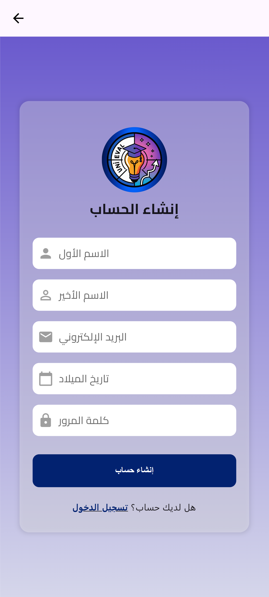

# Signin_up_with_onbording_dart 

`Signin_up_with_onbording_dart` This Flutter application allows users to register and log in with a user-friendly interface in Arabic. It includes onboarding screens and utilizes various widgets for a seamless experience.

## Features
- User registration and login
- Onboarding screens with custom animations
- Responsive design
- Custom text fields and buttons

## Screenshots


### Example: Feature Overview

<div style="display: flex; justify-content: space-around;">
    
    
   // 
</div>

## Getting Started

### Prerequisites
Make sure you have Flutter installed on your machine. You can follow the instructions [ [Lab: Write your first Flutter app](https://docs.flutter.dev/get-started/codelab)
- [Cookbook: Useful Flutter samples](https://docs.flutter.dev/cookbook)].

### Setup
1. Clone the repository:

   ```bash
   git clone https://github.com/Aimanalhammadi/Signin_up_with_onbording_dart.git
   cd Signin_up_with_onbording_dart

2.Install the required packages:
### Dependencies
---
- `google_fonts:`


Copy
 bash
        flutter pub get
      ---  
         flutter run

You can find the packages in the pubspec.yaml file of your project.

### Project Structure

```shell  
Copy
your_flutter_project/
│
├── android/
├── ios/
├── images/
├── lib/
│   ├── assets/
│   ├── models/
│   ├── screens/
│   ├── widgets/
│   ├── main.dart
│
├── test/
└── pubspec.yaml

```

### Contributing
If you'd like to contribute to this project, please fork the repository and submit a pull request.

### License
This project is licensed under the MIT License - see the LICENSE file for details.

### Acknowledgments
Inspiration, code snippets, etc.
